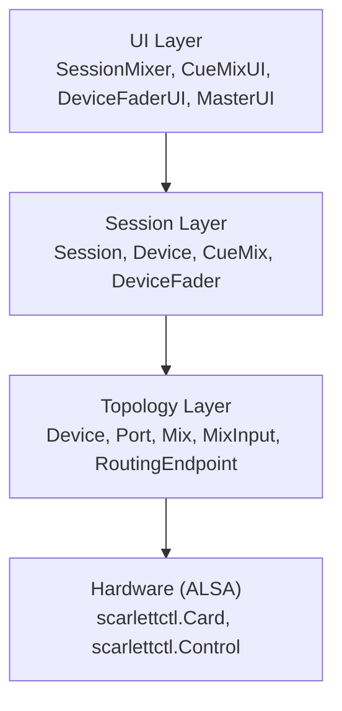
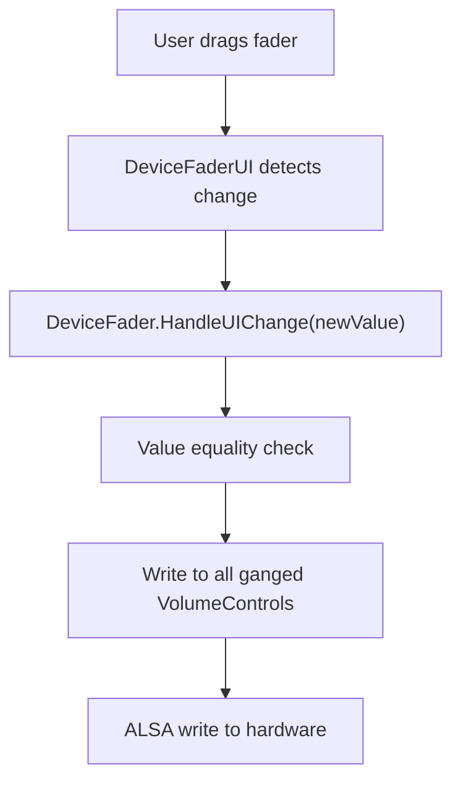
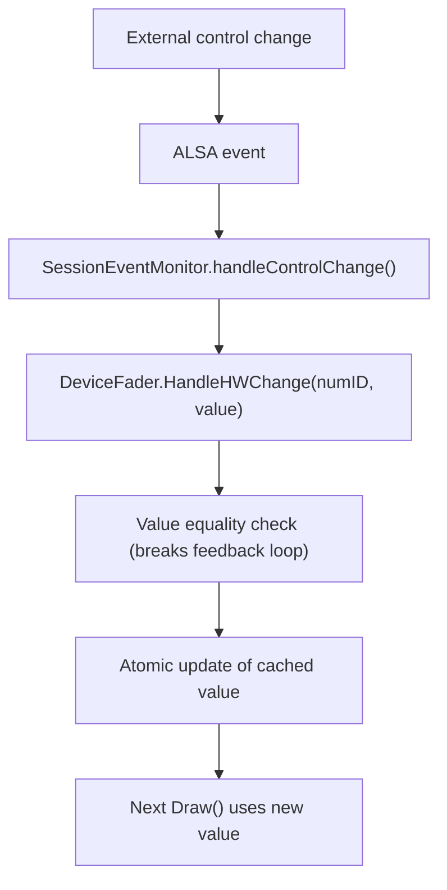
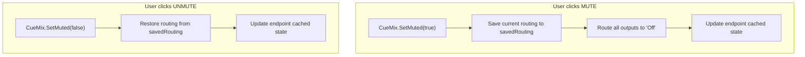
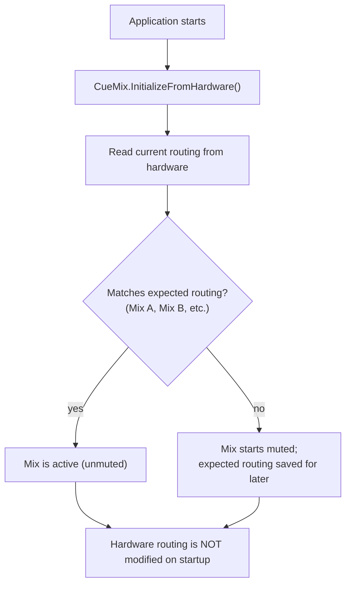

# sessionmixer - Development Notes

## Overview

`sessionmixer` is a custom mixer control surface application for Focusrite Scarlett audio interfaces. It uses the `dfx` immediate-mode GUI framework to provide a simplified, configurable interface for controlling hardware mixer settings via `scarlettctl`.

## Architecture

### Layer Overview



### Session Layer

The session layer provides user-friendly abstractions for devices and cue mixes.

**Key Concepts:**

1. **Devices** - Named audio sources mapped to topology ports
   - Examples: "DAW L+R" (pcm-playback-1, pcm-playback-2), "Vocal Mic" (analogue-in-1)
   - Can be mono (1 port) or stereo (2 ports)
   - Can represent inputs (for faders) or outputs (for routing)

2. **Cue Mixes** - Stereo mix allocations routed to hardware outputs
   - Uses mix pairs (A+B, C+D, etc.) for stereo
   - Contains device faders for volume control
   - Mute function disconnects outputs (routes to "Off")
   - Stereo mixes are automatically ganged
   - Respects existing hardware routing on startup

**Session Layer Files:**
- `session/types.go` - Config structs (SessionConfig, DeviceConfig, CueMixConfig)
- `session/session.go` - Runtime types (Session, Device, CueMix, DeviceFader)
- `session/builder.go` - SessionBuilder resolves config to topology
- `session/config.go` - Config loading
- `session/device_fader.go` - Bidirectional fader control
- `session/cuemix.go` - Mute and routing management

**UI Components:**
- `mixer.go` - Main SessionMixer component
- `cuemix_ui.go` - Collapsible cue mix section with dynamic column layout
- `device_fader_ui.go` - Device fader with VU meter and optional VU waterfall
- `master_ui.go` - Mute button, output VU meters, and optional VU waterfall
- `session_monitor.go` - Hardware event monitoring for session faders

### Topology Layer

The topology layer models the hardware capabilities of Scarlett interfaces.

**Key Types:**
- `Port` - Mono audio channel (analogue-in-1, pcm-playback-1, etc.)
- `Mix` - Mixer bus (A-L) with inputs
- `MixInput` - Single input to a mix with volume control
- `RoutingEndpoint` - Routable destination with source enum
- `Device` - Complete hardware topology
- `DeviceState` - Runtime state (levels, gang state)
- `DeviceProfile` - Device capability definitions

**Topology Files:**
- `topology/types.go` - Core types
- `topology/device.go` - Device structure and queries
- `topology/state.go` - Runtime state tracking
- `topology/profile.go` - DeviceProfile interface
- `topology/builder.go` - DeviceBuilder
- `topology/detect.go` - Profile auto-detection
- `topology/profiles/*.go` - Device-specific profiles

## Configuration

**Location:** `~/.config/sessionmixer/session.yaml`

**Structure:**
```yaml
card: 1                    # ALSA card number
level_smoothing: 8         # VU meter smoothing samples (0 = disabled)

# Device definitions - named sources/destinations mapped to ports
devices:
  # Input devices (for faders)
  - name: "DAW L+R"
    ports:
      - pcm-playback-1
      - pcm-playback-2

  - name: "Vocal Mic"
    ports:
      - analogue-in-1

  # Output devices (for routing)
  - name: "S/PDIF"
    ports:
      - spdif-out-1
      - spdif-out-2

# Cue mix allocations
cue_mixes:
  - name: "Main Monitors"
    mix_pair: "A+B"        # Stereo pair (Mix A + Mix B)
    outputs:
      - analogue-out-1
      - analogue-out-2
    devices:
      - "DAW L+R"
      - "Vocal Mic"

  - name: "S/PDIF Feed"
    mix_pair: "C+D"
    outputs: ["S/PDIF"]    # Can reference device names for outputs
    devices:
      - "DAW L+R"
```

**Port ID Format:**
- `analogue-in-1` through `analogue-in-9`
- `analogue-out-1` through `analogue-out-14`
- `spdif-in-1`, `spdif-in-2`, `spdif-out-1`, `spdif-out-2`
- `adat-in-1` through `adat-in-8`
- `pcm-playback-1` through `pcm-playback-24`

Use `sessionmixer topology` to see available ports.

## Data Flow

**UI → Hardware:**


**Hardware → UI:**


**Mute:**


**Startup Routing:**


## Building & Running

```bash
# Build
go build ./cmd/sessionmixer

# Run mixer GUI
./sessionmixer run

# Inspect device topology
./sessionmixer topology
./sessionmixer topology --routing
./sessionmixer topology --mixes
./sessionmixer topology --meters
```

## Device Profiles

Supported devices:
- **Scarlett 18i20 Gen 4 (FW 2399)** - 69 level meters, 12 mixes, 20 PCM capture
- **Scarlett 18i20 Gen 4 (FW 2464)** - 69 level meters, 12 mixes, 26 PCM playback/capture, 16 ADAT I/O
- **Scarlett 16i16 Gen 4** - 54 level meters, 12 mixes

Profiles are automatically selected based on card name and firmware version. Multiple profiles can exist for the same device with different firmware versions.

To add a new device or firmware variant:
1. Create `topology/profiles/scarlett_XXX.go`
2. Implement `DeviceProfile` interface
3. Register with specific firmware version in `init()` function
4. Profile auto-detects via card name and firmware version match

## Dependencies

- `github.com/michaelquigley/dfx` - Immediate mode GUI
- `github.com/michaelquigley/scarlettctl` - Focusrite control library
- `github.com/michaelquigley/df/dd` - Configuration loading
- `github.com/AllenDang/cimgui-go/imgui` - ImGui bindings

## Developer Notes

### Bidirectional Updates

The key to preventing feedback loops is value equality checks:
1. UI writes value X to hardware
2. Hardware fires event with value X
3. Event handler sees oldValue == newValue
4. Returns early - no UI update triggered
5. Loop broken

### Stereo Ganging

For stereo cue mixes (A+B) with stereo devices:
- Mix A Input 01 (pcm-playback-1) and Mix B Input 02 (pcm-playback-2)
- Single fader controls both volume controls

For mono devices in stereo cue mixes:
- Same input number in both mixes
- Both volumes ganged together

### Level Metering

- 96 dB dynamic range for sensitivity
- HSV color gradient: green → yellow → red
- Optional ring buffer smoothing
- VU meters: highres mode with 1px segments and 1px gaps

### VU Waterfall

The VU waterfall displays level history over time, scrolling upward with newest data at the bottom.

**Toggle:** Click on any channel title (device name or output label) to show/hide the waterfall.

**Implementation details:**
- Uses `dfx.VUWaterfall` component
- Time-based sampling (16ms interval) for consistent scroll speed regardless of frame rate
- Highres mode: alternates row opacity (30% on odd rows) for scanline effect
- 1px row height, matching VU meter aesthetic
- Dynamic column width adjustment when waterfall is shown/hidden
- History stored in circular buffer (300 samples for device faders, 303 for master)

### Mute State and Routing

The mute implementation must keep the endpoint's cached `currentSourceIndex` synchronized:
- When muting: save current source, set to "Off", update cache
- When unmuting: restore saved source, update cache
- Failure to update cache causes incorrect behavior on subsequent mute/unmute cycles

### Device Names in Outputs

The `outputs` field in cue mix config supports both:
- Raw port IDs: `["analogue-out-1", "analogue-out-2"]`
- Device names: `["S/PDIF"]` (expands to device's ports)

Device names take precedence if there's a naming conflict.

## References

- [docs/BIDIRECTIONAL_UPDATE_STRATEGY.md](docs/BIDIRECTIONAL_UPDATE_STRATEGY.md)
- [docs/18i20g4-2399-layout.md](docs/18i20g4-2399-layout.md)
- [docs/18i20g4-2464-layout.md](docs/18i20g4-2464-layout.md)
- [docs/16i16g4-layout.md](docs/16i16g4-layout.md)
- [dfx documentation](https://github.com/michaelquigley/dfx)
- [scarlettctl documentation](https://github.com/michaelquigley/scarlettctl)

## Project memory

Durable knowledge about this project lives in `docs/journal/`, dated files `docs/journal/YYYY-MM-DD.md`. This is project memory; it does not go in harness-local storage (`.claude/` or equivalent), where it's invisible to every other harness and collaborator and dies with the host. Concretely: do not write to your harness's memory directory or memory tool for this project — even when the harness presents it as the default place for durable knowledge. That tool is the silo this convention exists to replace; the journal is the only durable home.

On arrival, read the most recent entries to pick up where the last session left off, before you start changing things. Treat them as prior-session context, not verified truth — if an entry conflicts with the code or a `docs/current/` doc, the code wins.

Write the smallest entry that carries the session's durable insight, and nothing more. The test for every line: *would a competent agent get this wrong, or waste time rediscovering it, working from the tree alone?* If it's recoverable by reading the code, the diff, `docs/current/`, or git history, leave it out.

That filter keeps four kinds of thing and discards the rest:

- **Decisions whose rationale isn't visible in the result** — why a value was chosen, what a line guards against, why something that looks like dead code or a no-op is load-bearing.
- **Deliberate non-actions** — a change you considered and chose not to make, so the next agent doesn't "fix" it. An unchanged file leaves no trace in a diff.
- **Couplings that span files** — two places that must move together, an ordering that matters, an assumption one file makes about another.
- **Live state** — what's unverified, unfinished, or waiting on something external.

Skip change inventories, restatements of the diff, and play-by-play of how you worked. There's no write-time approval gate; Michael reviews on commit. Append to the day's file if it exists, and write the few lines you'd want the next agent to read — honest and self-contained.

## Commits

The operator commits; agents don't. Never run `git commit` or `git push` in this repo. Finish the edit, leave the change in the working tree (staged is fine), report what changed, and hand off — the uncommitted diff is the review queue and the commit is the operator's act of acceptance. Approval of a change is not direction to commit; only an explicit instruction to commit is, and only for that commit.

## Roadmap

This repo's roadmap lives in `docs/future/roadmap/` — one frontmatter-markdown item per file, per the roadmap convention in the grimoire (software/conventions/roadmap-convention.md). You may add items freely: write the file directly with required `title`, `state: inbox`, and `created:` (today, YYYY-MM-DD), optional `tags`/`source`/`log`, and a body that is a small, clear prompt -- the problem or solution to execute, not documentation of it; trust the code and the day's journal entry for what's discoverable, and point a `log:` stamp at the specific journal entry when a card leans on hard-won context. Everything above the first `##` heading is the prompt; supporting material that isn't the prompt goes in named sections below it (`## why` for justification, `## background` for a longer description), which are conventional, never required, and never validated. The filename is the slug of the title (lowercase ASCII, hyphens; discard every other character); never overwrite an existing file. Read sibling items for the shape.

Hard rules: never touch `order.yaml` (priority is the operator's judgment, set at triage); never commit roadmap changes unless directed — the uncommitted diff is the review queue; never delete items; edits change only the lines that express them. Label the kind from the house set when one fits: defect, documentation, enhancement, epic, feature, story; add `spike` alongside it when the work carries unknowns that need discovery.
