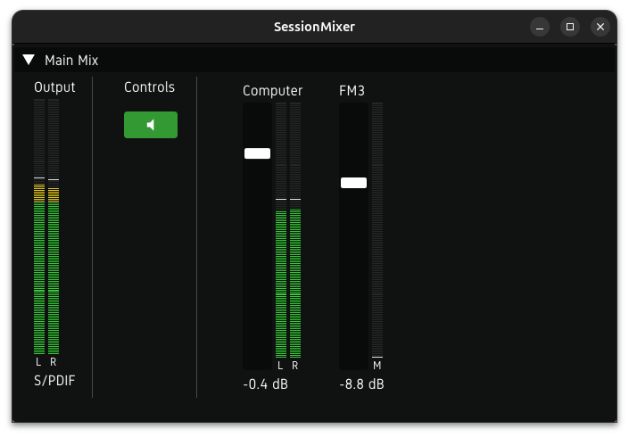

# sessionmixer

A lightweight, configurable desktop mixer for controlling cue mixes and audio routing on audio interfaces with onboard mixing.

## Project Roadmap

Take a look at the [project roadmap board](https://github.com/users/michaelquigley/projects/3/views/1) to better understand what's on deck for sessionmixer.

## Demo



*sessionmixer controlling a Focusrite Scarlett interface with real-time level metering*

## Overview

**sessionmixer** provides an ergonomic control surface for audio interfaces that include onboard DSP mixing capabilities. Instead of navigating complex manufacturer software, sessionmixer lets you create a streamlined, personalized mixer layout with just the controls you need.

Whether you're managing monitor mixes in a recording session, routing audio for a podcast, or controlling a live streaming setup, sessionmixer gives you quick access to the controls that matter most.

### Supported Hardware

- **Focusrite Scarlett** (4th generation) - Tested with 16i16 and 18i20
- Additional interface support planned for future releases

## Features

- **Automatic Device Detection** - Detects your Scarlett interface and loads the appropriate device profile
- **Device Topology Discovery** - Inspect your interface's ports, mixes, routing, and level meters
- **Cue Mix Management** - Create multiple independent cue mixes routed to different outputs
- **Device-Centric Configuration** - Name your audio sources (instruments, mics, DAW channels) and use them across mixes
- **Stereo Ganging** - Stereo mix pairs automatically gang faders for linked control
- **Mute with Routing** - Mute disconnects outputs by routing to "Off", unmute restores routing
- **Non-Destructive Startup** - Respects existing hardware routing; mixes start muted if not already routed
- **Level Metering** - Real-time VU meters for both device inputs and mix outputs
- **Level Smoothing** - Configurable ring buffer averaging for smooth meter response
- **Bidirectional Sync** - Changes made externally (other software, hardware controls) are reflected in the UI
- **YAML Configuration** - Simple, human-readable configuration files

## Requirements

- **Linux** with ALSA
- **Go 1.24+** (for building from source)
- A supported audio interface

### Dependencies

sessionmixer uses [scarlettctl](https://github.com/michaelquigley/scarlettctl) to communicate with Focusrite interfaces and [dfx](https://github.com/michaelquigley/dfx) for the user interface.

## Installation

```bash
# Clone the repository
git clone https://github.com/michaelquigley/sessionmixer.git
cd sessionmixer

# Build
go build ./cmd/sessionmixer

# Install (optional)
sudo cp sessionmixer /usr/local/bin/
```

## Configuration

sessionmixer uses a YAML configuration file located at:

```
~/.config/sessionmixer/session.yaml
```

### Example Configuration

```yaml
# ALSA card number (use `aplay -l` to find your device)
card: 1

# VU meter smoothing (number of samples to average, 0 = disabled)
level_smoothing: 8

# Device definitions - named audio sources mapped to hardware ports
devices:
  # Stereo devices (2 ports)
  - name: "DAW L+R"
    ports:
      - pcm-playback-1
      - pcm-playback-2

  - name: "Guitar FX"
    ports:
      - pcm-playback-3
      - pcm-playback-4

  # Mono devices (1 port)
  - name: "Vocal Mic"
    ports:
      - analogue-in-1

  - name: "Talkback"
    ports:
      - analogue-in-2

  # Output devices (for routing shorthand)
  - name: "S/PDIF"
    ports:
      - spdif-out-1
      - spdif-out-2

# Cue mix allocations
cue_mixes:
  # Main monitors - full mix
  - name: "Main Monitors"
    mix_pair: "A+B"           # Stereo pair using Mix A and Mix B
    outputs:
      - analogue-out-1        # Left output
      - analogue-out-2        # Right output
    devices:
      - "DAW L+R"
      - "Guitar FX"
      - "Vocal Mic"

  # Performer cue - DAW and talkback only
  - name: "Performer Cue"
    mix_pair: "C+D"
    outputs:
      - analogue-out-3
      - analogue-out-4
    devices:
      - "DAW L+R"
      - "Talkback"

  # S/PDIF feed using device name for outputs
  - name: "S/PDIF Feed"
    mix_pair: "E+F"
    outputs: ["S/PDIF"]       # References the S/PDIF device
    devices:
      - "DAW L+R"
```

### Configuration Reference

**Root Fields:**

| Field | Description |
|-------|-------------|
| `card` | ALSA card number for your interface |
| `level_smoothing` | Number of samples to average for level meters (0 = disabled) |
| `devices` | List of named audio sources/destinations |
| `cue_mixes` | List of cue mix definitions |

**Device Fields:**

| Field | Description |
|-------|-------------|
| `name` | Display name for this device |
| `ports` | List of port IDs (1 for mono, 2 for stereo) |

**Cue Mix Fields:**

| Field | Description |
|-------|-------------|
| `name` | Display name for this cue mix |
| `mix_pair` | Mix pair to use: `"A+B"`, `"C+D"`, etc. for stereo; `"A"`, `"C"`, etc. for mono |
| `outputs` | Hardware output ports or device names |
| `devices` | List of device names to include in this mix |

### Port ID Format

Use `sessionmixer topology` to see available ports on your device.

Common port ID patterns:
- `analogue-in-1` through `analogue-in-N` - Hardware analogue inputs
- `analogue-out-1` through `analogue-out-N` - Hardware analogue outputs
- `spdif-in-1`, `spdif-in-2` - S/PDIF inputs
- `spdif-out-1`, `spdif-out-2` - S/PDIF outputs
- `adat-in-1` through `adat-in-8` - ADAT inputs
- `pcm-playback-1` through `pcm-playback-N` - DAW playback channels

## Usage

```bash
# Run the mixer
./sessionmixer run

# Inspect device topology
./sessionmixer topology

# Show routing endpoints
./sessionmixer topology --routing

# Show mixes
./sessionmixer topology --mixes

# Show level meters
./sessionmixer topology --meters
```

### UI Layout

Each cue mix appears as a collapsible section containing:

- **Output VU meters** - Shows the mix output levels and configured outputs
- **Mute button** - Disconnects outputs (routes to "Off") when muted
- **Device faders** - One fader per device with input VU meters

### Behavior

- **Stereo ganging** - Stereo mix pairs (A+B, C+D, etc.) automatically gang faders
- **Mute** - Routes outputs to "Off" and saves current routing for restore
- **Startup** - Reads hardware routing state; if routing doesn't match expected, mix starts muted
- **Bidirectional sync** - External changes are reflected in the UI

## License

MIT
